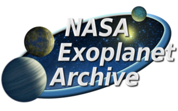

    

<h1 align="center">
    Habitable Planets Parser
</h1>

<h5 align="center">
    Data gathered from the <a href="https://exoplanetarchive.ipac.caltech.edu/docs/data.html">NASA Exoplanet Archive</a> 
</h5>

## Intro

A mini-program built with Deno to parse through NASA's exoplanet archive for Earth-like planets that fits within a set of habitable range profile.

## Installation

_**Note: Before running the program, please ensure you have Deno installed on your machine.**_

1. Follow the installation instructions on the Deno offical website: https://deno.land/
2. In your terminal, run: `deno run --allow-read mod.ts`
3. You should see the program return a list of planet objects with the number of habitable planets:

   `{`

        koi_prad: "0.90",
        koi_smass: "0.9090",
        koi_srad: "0.9930",
        kepler_name: "Kepler-1560 b",
        koi_count: "1",
        koi_steff: "5755.00",
        koi_period: "3.031968120"

   `}`

   `8 habitable planets found!`

## :memo: License 

This project is licensed under the terms of the MIT license. For more information, please refer to the license [documentation](LICENSE.md).
